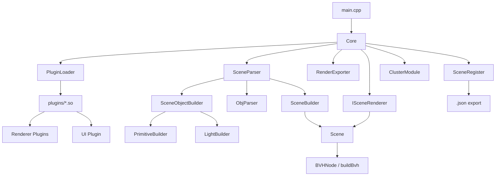

# Raytracer Architecture

## Overview

The codebase is organized around a central `Core` that orchestrates scene loading, plugin loading, rendering, optional UI, and optional cluster mode.

- Entry point and orchestration:
  - `main.cpp`
  - `srcs/core/Core.*`
- Scene load/save and construction:
  - `srcs/core/scene/SceneParser.*`
  - `srcs/core/scene/builder/*`
  - `srcs/core/scene/factory/*`
  - `srcs/core/scene/SceneRegister.*`
- Scene runtime data:
  - `srcs/core/scene/Scene.*`
  - `srcs/core/scene/bvh/*`
- Plugin loader and interfaces:
  - `srcs/core/PluginLoader.*`
  - `srcs/common/IPlugin.hpp`
  - `srcs/common/IPluginLoader.hpp`
- Renderer/UI plugins:
  - `srcs/plugins/renderer/*`
  - `srcs/plugins/user_interface/*`
- Geometric/light implementations:
  - `srcs/plugins/primitive/*`
  - `srcs/plugins/light/*`
- Optional cluster infrastructure:
  - `srcs/core/cluster/*`
  - `srcs/common/cluster/*`

## Module Dependency Diagram

## Responsibility Breakdown

### Core Layer

Coordinates the full lifecycle:

1. Load configuration/plugins.
2. Parse `.json` and construct scene through builders.
3. Select renderer plugin.
4. Build BVH and render.
5. Export image.
6. Optionally run UI event loop and file hot-reload.

### Scene Layer

Owns renderable data:

- Camera parameters.
- Primitive instances.
- Light instances.
- Material registry and coefficients.
- BVH acceleration structure.

### Plugin Layer

Current dynamic plugin loading is used for renderer and UI modules (`PluginType::RENDERER`, `PluginType::USER_INTERFACE`) compiled as shared libraries in `plugins/`.

Primitive and light implementations currently live in `srcs/plugins/*` but are linked into the main binary and instantiated via builders/factories.

### Builder/Factory Layer

Provides type-driven construction from scene config:

- `SceneObjectBuilder`: dispatches object construction to primitive/light builders.
- `PrimitiveBuilder`: constructs `Sphere`, `Plane`, `Cube`, `Cylinder`, `Cone`, `Triangle`, `Torus`, `Tanglecube`, `Fractal`.
- `LightBuilder`: constructs `PointLight` and `DirectionalLight`.
- `PrimitiveFactory`/`LightFactory`: default constructors for editor/runtime creation.

### Utility Layer

Provides math, exceptions, file watching, scene export, and OBJ import support.

## Related Docs

- [plugins.md](./plugins.md)
- [builders-and-factories.md](./builders-and-factories.md)
- [rendering-pipeline.md](./rendering-pipeline.md)

- Interface-driven architecture for testability and extensibility.
- Separation between parsing, data ownership, and rendering logic.
- Ability to swap object implementations via plugins.
- Explicit math/data structures for predictable rendering behavior.
