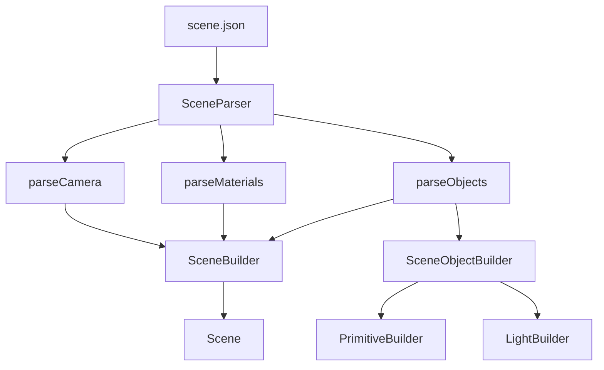

# Builders And Factories

## Overview

Scene construction is split into:

- Parsing (`SceneParser`)
- Typed object assembly (`SceneObjectBuilder`, `PrimitiveBuilder`, `LightBuilder`)
- Scene aggregation (`SceneBuilder`)
- Optional direct type creation (`PrimitiveFactory`, `LightFactory`)

This keeps config parsing independent from concrete constructor details.

## Build Flow From `.json`

## SceneObjectBuilder

`SceneObjectBuilder` is a dispatcher:

- `withType(string)` sets primitive mode.
- `withType(LightType)` sets light mode.
- Common setters (name, position, etc.) are forwarded to the active internal builder.
- `build()` returns `ISceneObject*` (either `IPrimitive*` or `ILight*`).

Supported parsed object type strings:

- Primitives: `sphere`, `plane`, `cube`, `cylinder`, `cone`, `triangle`, `torus`, `tanglecube`, `fractal`
- Lights: `point_light`, `directional_light`
- Special import case: `type = "object"` with OBJ path (through `ObjParser`)

## PrimitiveBuilder

Constructs concrete primitives with parsed properties.

Main mapped fields include:

- Spatial: `position`, `rotation`, `scale`
- Geometric: `radius`, `height`, `size`, `axis`
- Specialized: `vertex0`, `vertex1`, `vertex2`, `threshold`, `power`, `iterations`
- Surface: `material`

## LightBuilder

Constructs concrete lights from:

- `name`
- `position` (point light)
- `direction` (directional light)
- `intensity`
- `color`

## SceneBuilder

Aggregates camera, materials, and object list into a final `Scene` instance.

During `build()`:

1. Creates `Scene(camera, ambientCoeff, diffuseCoeff)`.
2. Registers materials by name.
3. Dispatches object list by runtime `ObjectType`:
   - `PRIMITIVE -> addPrimitive`
   - `LIGHT -> addLight`

## Factories

Factories are utility constructors using default values:

- `PrimitiveFactory::createPrimitive(type)`
- `LightFactory::createLight(type)`

They are useful for editor actions and dynamic creation where parsing is not involved.

## Save Path (Reverse Direction)

`SceneRegister` serializes runtime scene state back to `.json`:

- camera
- environment coefficients
- objects (primitive/light properties)
- materials

This enables round-trip editing in the UI.
