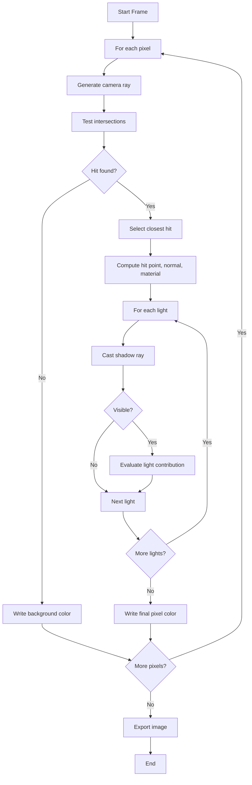

# Rendering Pipeline

## Overview

A frame is generated by applying the same sequence to every pixel:

1. Generate a camera ray.
2. Intersect it with all relevant primitives.
3. Keep the closest valid hit.
4. Evaluate shading (direct light + material response from renderer model).
5. Write final color to output.

## Single-Frame Step-by-Step

### 1. Camera Setup and Pixel Sampling

The renderer prepares camera basis vectors and projection parameters (field of view, aspect ratio, viewport size). For each pixel `(i, j)`, it computes normalized coordinates, then constructs a ray origin `O` and direction `D`.

### 2. Primary Ray Generation

Each primary ray uses the canonical equation:

```text
P(t) = O + t * D
```

with bounds `t in [t_min, t_max]`.

### 3. Scene Intersection Pass

The engine tests the ray against scene primitives. Each primitive intersection routine returns either:

- No hit, or
- A hit record with `t`, hit point, normal, and material reference.

The renderer retains the smallest valid `t` greater than `t_min`.

In this project, BVH acceleration is built before rendering (`scene.buildBvh()`).

### 4. Shading Preparation

At closest hit:

- Compute world-space hit point: `H = O + t_hit * D`.
- Compute and orient surface normal `N`.
- Fetch material parameters (for example Phong coefficients).

### 5. Per-Light Illumination and Shadows

For each light (currently point and directional):

1. Build light vector `L` from hit point (or light direction for directional light).
2. Cast shadow ray from a biased point `H + epsilon * N` toward the light.
3. If occluded, skip direct contribution for this light.
4. If visible, evaluate diffuse and specular terms.
5. Apply attenuation when the light has finite distance behavior.

### 6. Color Accumulation

Final pixel color is assembled from:

- Scene ambient coefficient + visible direct light terms.
- Clamped or tone-mapped to output color range.

### 7. Output

After all pixels are computed, the image buffer is exported to `render.png`.

## Runtime Integration Notes

When UI mode is enabled:

1. The core loop watches the scene config file for changes.
2. On change, the scene is reloaded.
3. Rendering can be requested from UI actions.

When no UI plugin is loaded, a direct render path is used.

## Pipeline Flowchart



## Numerical Robustness Notes

- Use `epsilon` offset for secondary/shadow rays to avoid self-intersection (shadow acne).
- Reject near-zero denominators in linear solves (plane/triangle intersections).
- Enforce `t > t_min` and `t < t_max` consistently.
- Normalize vectors used in dot products for physically meaningful shading.
