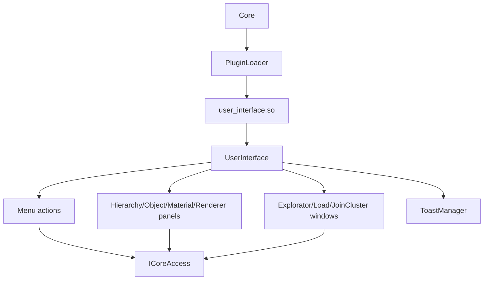

# User Interface Plugin

## Overview

The user interface is implemented as a runtime plugin (`user_interface.so`) and loaded by the core plugin loader.

- Source root: `srcs/plugins/user_interface/`
- Plugin type: `PluginType::USER_INTERFACE`
- Main class: `UserInterface` (implements `IUserInterface`)

## Responsibilities

The UI provides:

- Scene lifecycle actions (new/open/save/save as/import).
- Object creation from menu (primitives/lights).
- Selection and property editing panels.
- Render status and render-view controls.
- Cluster join/start actions through dedicated windows.
- Toast notifications for success/errors.

## Documentation Index

- [Core](./core/README.md)
- [Components](./components/README.md)
- [Panels](./panels/README.md)
- [Windows](./windows/README.md)
- [Toast System](./toast/README.md)

## Internal Structure

```text
srcs/plugins/user_interface/
├── UserInterface.*            # Plugin entry class and event loop
├── Theme.hpp                  # Shared theme constants
├── Component.hpp              # Base component abstraction
├── VerticalLayout.hpp         # Basic layout helper
├── ViewportHelper.hpp         # Viewport interaction helpers
├── components/                # Reusable widgets (button, slider, dropdown...)
├── components/menu/           # Menu bar/menu items
├── panels/                    # Domain panels (hierarchy, object, material, renderer)
├── windows/                   # Modal windows (explorer/load/join cluster)
└── toast/                     # Notification manager and toast rendering
```

## Runtime Integration

1. Core loads plugins from `./plugins`.
2. UI plugin is retrieved by type `USER_INTERFACE`.
3. `create(ICoreAccess&)` is called.
4. UI uses `ICoreAccess` to trigger scene/render actions.
5. On shutdown, `destroy()` is called and plugin instance is unloaded.

## High-Level Interaction Flow



## Main Panels

- `HierarchyPanel`: scene object listing and selection.
- `ObjectPanel`: object property editing.
- `MaterialPanel`: material-related controls for selected object.
- `RendererPanel`: render state display and render-view controls.

## Main Windows

- `ExploratorWindow`: open/save path selection.
- `LoadWindow`: merge/import workflow.
- `JoinClusterWindow`: cluster connection/host interaction.

## Menus and Actions

The UI builds menu actions for:

- `Scene`: new, open, save, save as, import.
- `Add`: primitive/light insertion through core scene APIs.
- Rendering and cluster controls via dedicated commands.

## Notes

- The UI depends on SFML (`graphics`, `window`, `system`, `network`) as configured in the Makefile.
- If the viewport renderer plugin is missing, the UI reports it through a toast and keeps running.

